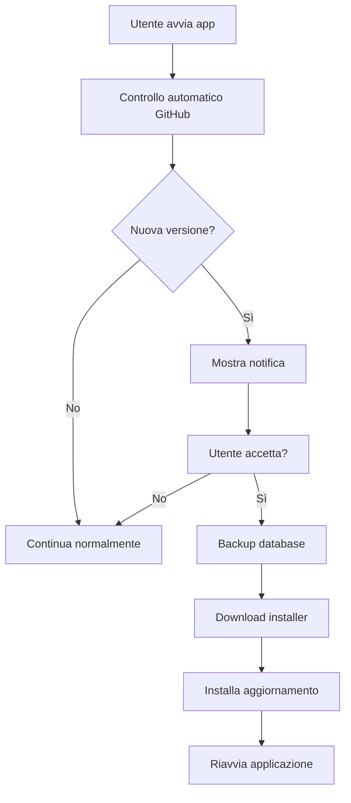

# 🚀 MoneyMind - Guida Setup Sistema Aggiornamenti

## ⚙️ Configurazione Iniziale

### 1. Configura GitHub Repository
Modifica il file `ApplicationInfo.vb`:
```vb
Public Shared ReadOnly Property GitHubRepository As String = "TUO_USERNAME/MoneyMind"
```

### 2. Setup MSI Installer (Opzionale - WiX)
Se vuoi usare il setup MSI professionale:
- Installa [WiX Toolset v3.11+](http://wixtoolset.org/releases/)
- Aggiungi il progetto `MoneyMind.Setup` alla solution
- Modifica gli GUID nel file `Product.wxs`

### 3. Build dell'Applicazione
```bash
# Compila la Release
msbuild MoneyMind.sln /p:Configuration=Release

# OPPURE usa Visual Studio
# Build > Rebuild Solution (Release mode)
```

## 📦 Rilascio Nuovo Aggiornamento

### Step 1: Aggiorna Versione
1. Modifica `ApplicationInfo.vb`:
```vb
Public Shared ReadOnly Property CurrentVersion As String = "1.1.0"  ' Nuova versione
```

2. Compila l'applicazione in **Release**

### Step 2: Crea Release su GitHub
1. Vai su GitHub > **Releases** > **Create a new release**

2. **Tag version**: `v1.1.0` (con prefisso 'v')

3. **Release title**: `Versione 1.1.0`

4. **Describe this release**:
```markdown
## Novità della versione 1.1.0

🆕 **Nuove funzionalità:**
- Sistema di aggiornamenti automatici
- Backup automatico del database
- Interfaccia migliorata per la gestione pattern

🔧 **Correzioni:**
- Risolto bug nell'importazione Excel
- Migliorata stabilità dell'applicazione
- Ottimizzate le performance dei grafici

⚡ **Miglioramenti:**
- Interfaccia utente più responsive  
- Ridotti i tempi di caricamento del 40%
- Supporto per file Excel più grandi
```

5. **Carica Files**:
   - `MoneyMind.exe` (o MSI se disponibile)
   - Qualsiasi altro file necessario

6. **Publish release** ✅

### Step 3: Test Automatico
- Gli utenti riceveranno la notifica automaticamente all'avvio
- Possono cliccare "Aggiornamenti" per controllo manuale

## 🔄 Workflow Completo Aggiornamento



## 📋 Checklist Pre-Release

- [ ] **Codice**: Testato e funzionante
- [ ] **Versione**: Aggiornata in `ApplicationInfo.vb`
- [ ] **Build**: Compilazione Release completata
- [ ] **Changelog**: Preparato con dettagli modifiche
- [ ] **Files**: Pronti per l'upload (EXE/MSI)
- [ ] **GitHub**: Repository pubblico e accessibile
- [ ] **Test**: Verificato aggiornamento su macchina di test

## 🛠️ Risoluzione Problemi

### Errore "Repository non trovato"
- Verifica che il repository sia **pubblico**
- Controlla il nome in `ApplicationInfo.vb`
- URL deve essere: `https://api.github.com/repos/USERNAME/REPO/releases`

### Download fallisce
- File deve essere negli **Assets** della release
- Nome file deve corrispondere a `InstallerFileName`
- Verifica connessione internet utente

### Backup non funziona
- Controlla permessi scrittura nella cartella utente
- Verifica che il database esista
- Path database configurato correttamente

## 📱 Esperienza Utente

### All'avvio (silenzioso):
- Controllo aggiornamenti in background
- Solo se trovato: notifica discreta
- Nessun rallentamento dell'app

### Controllo manuale:
- Bottone "Aggiornamenti" sempre visibile
- Feedback immediato sullo stato
- Changelog dettagliato mostrato

### Durante aggiornamento:
- Backup automatico dei dati
- Progress bar del download
- Conferma prima dell'installazione
- Chiusura app e installazione MSI

## 🎯 Benefici Sistema

✅ **Per lo sviluppatore:**
- Deploy semplificato via GitHub
- Controllo completo delle release
- Statistiche download automatiche
- Changelog centralizzato

✅ **Per gli utenti:**
- Aggiornamenti automatici
- Dati sempre al sicuro (backup)
- Interfaccia professionale
- Nessuna perdita di configurazioni

---

**🎉 Il sistema è ora completamente configurato e pronto!**

I tuoi amici riceveranno automaticamente tutti i futuri aggiornamenti! 🚀